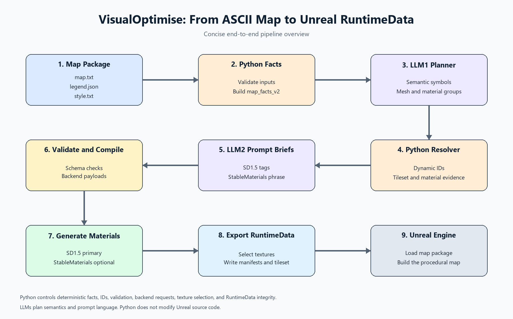
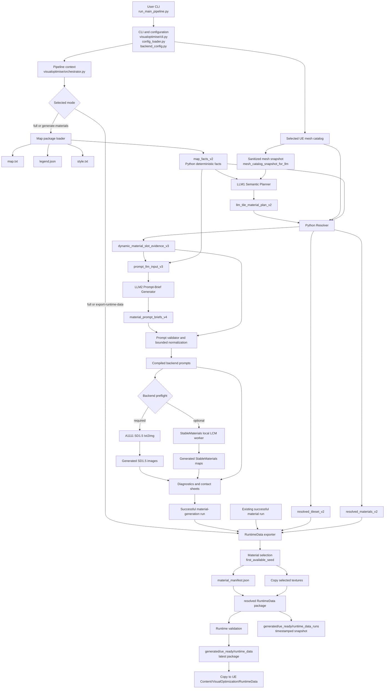

# VisualOptimise: Map-Driven Procedural Material Pipeline

## 1. Project Purpose

VisualOptimise is a self-contained Python pipeline for converting a tile-based
ASCII map package into reusable material previews and UE-copyable runtime data.
The project is designed for procedural 2.5D/isometric game production, but the
material generation stage is deliberately independent from a specific map,
fixed material-slot list, or previous experiment package.

The user supplies:

- an ASCII layout in `map.txt`;
- a symbol legend in `legend.json`;
- a visual style description in `style.txt`;
- a selectable UE logical mesh catalog;
- configured access to DeepSeek, A1111 Stable Diffusion WebUI, and optionally
  StableMaterials.

The pipeline produces:

1. structured semantic planning artifacts;
2. backend-specific material prompts;
3. SD1.5 and optional StableMaterials material images;
4. diagnostics, validation results, and contact sheets;
5. a resolved tileset and material manifest;
6. a UE-copyable `RuntimeData` package.

For a concise presentation view, use the companion diagram:



The final Python entry point is:

```text
run_main_pipeline.py
```

The runtime package is prepared inside the Python project and can then be
copied to the existing Unreal project. Python does not modify Unreal source
files or compile the UE project.

## 2. End-to-End Architecture



## 3. User-Visible Execution Modes

The CLI accepts one primary mode per invocation.

| Mode | Purpose | LLM calls | Image generation | RuntimeData |
|---|---|---:|---:|---|
| `--full` | Material generation followed by export | 2 | SD1.5 and optional StableMaterials | Refreshes latest and writes a snapshot |
| `--generate-materials` | Material planning and preview generation only | 2 | SD1.5 and optional StableMaterials | Not exported by this mode |
| `--export-runtime-data` | Package an existing successful material run | 0 | 0 | Creates a package and normally refreshes latest |
| `--b3-submission-hardening-validation` | Validate configuration, isolation, and compatibility | 0 | 0 | Uses validation/export checks without new images |

Typical full execution:

```powershell
I:\MiniConda3\envs\dissertation\python.exe I:\Disertation\VisualOptimise\run_main_pipeline.py --map test_map1_clean --full --images-per-material 1
```

Multiple maps are processed sequentially. Each map receives its own material
generation run and its own RuntimeData map package:

```powershell
I:\MiniConda3\envs\dissertation\python.exe I:\Disertation\VisualOptimise\run_main_pipeline.py --maps test_map1_clean test_map2 --full --images-per-material 1
```

The `--map-root` and `--mesh-catalog` options override configured input paths
for the current invocation. This makes the map package and mesh catalog
replaceable without changing source code.

## 4. Stage A: Configuration and Pipeline Context

### Main files

- `run_main_pipeline.py`: very thin executable wrapper.
- `visualoptimise/cli.py`: parses modes, maps, paths, seeds, image count,
  backend switches, and RuntimeData refresh policy.
- `visualoptimise/config_loader.py`: loads project settings and defaults.
- `visualoptimise/backend_config.py`: loads WebUI, StableMaterials, and UE
  destination paths from `settings/backend_paths.json`.
- `visualoptimise/orchestrator.py`: creates the per-invocation main run,
  executes stages, records stage references, and writes the final summary.

The main context carries the project root, output root, settings, backend
configuration, and helper methods used by the extracted stage modules. It does
not own map-specific semantic decisions.

### Configuration precedence

For map and catalog selection:

1. CLI values, when supplied;
2. `settings/pipeline_defaults.json`;
3. built-in relative defaults.

For generation count and seeds:

1. `--seeds` and `--images-per-material`;
2. `settings/material_generation_defaults.json`;
3. random seed generation when neither CLI nor config supplies a value.

For backend locations, `settings/backend_paths.json` is the source of truth.
Secrets are read by the LLM artifact helper from the configured secret file or
environment according to the project configuration. The key is never placed
in reports or payload artifacts.

## 5. Stage B: Deterministic Map Facts

### Input

Each selected map directory must contain:

```text
data/maps/<map_id>/
  map.txt
  legend.json
  style.txt
```

### Implementation

`visualoptimise/semantic_planning.py` validates the package and builds
`map_facts_v2`.

Python determines facts that must not be guessed by an LLM:

- map ID;
- width and height;
- complete ASCII rows;
- used symbols;
- symbol counts;
- coordinate samples;
- legend names and descriptions;
- declared material-family hints, when present in the map legend;
- complete style text.

This stage is deterministic. It does not decide final material slots, mesh
IDs, or image prompts.

## 6. Stage C: Mesh Catalog Snapshot

The selected catalog is read by Python and converted to a sanitized snapshot
for LLM1. The snapshot contains logical UE mesh capabilities:

- `mesh_id`;
- description;
- `role_tags`;
- `shape_type`;
- `height_class`;
- optional `surface_orientation`.

The LLM does not receive old material-slot rules, old material evidence,
texture paths, or RuntimeData paths.

`surface_orientation` is mesh capability metadata, not a material decision. The
supported values are:

```text
horizontal_surface
vertical_surface
panel_surface
liquid_surface
sloped_surface
```

If an older catalog has no `surface_orientation`, Python uses the established
`shape_type` compatibility fallback and records the fallback source in the
generated evidence.

## 7. Stage D: LLM1 Semantic Material Planner

### LLM1 responsibility

LLM1 receives only:

1. `map_facts_v2`;
2. `mesh_catalog_snapshot_for_llm`;
3. the LLM1 system instructions and JSON schema.

LLM1 plans map semantics. It does not write Stable Diffusion prompts.

Its output is `llm_tile_material_plan_v2`, containing two related views:

### Symbol plans

Each used symbol is described with:

- symbol identity and legend reference;
- tile semantics;
- geometry generation decision;
- selected `mesh_id` or `null`;
- selected mesh role tags;
- mesh selection reason;
- material-generation decision;
- proposed canonical material group;
- raw legend clues;
- contextual clues;
- planning reason and confidence.

### Canonical material groups

Groups answer which symbols can share a reusable material identity. A group
contains:

- descriptive `canonical_material_id_proposal`;
- source and covered symbols;
- primary prompt symbol;
- prompt-source symbols;
- excluded detail symbols;
- coarse material identity and category;
- raw material clues;
- context clues for the later prompt stage;
- expected mesh IDs;
- detail-symbol policy;
- planning confidence.

The grouping is dynamic. It is not the fixed legacy set of
`stone_wall`, `stone_floor`, `grass_ground`, and similar IDs. Python later
derives runtime IDs from the returned canonical groups.

LLM1 is retried with validation feedback when JSON parsing or schema checks
fail. The retry payload includes the prior validation errors and a bounded raw
response excerpt. All attempts are saved in the run for auditability.

## 8. Stage E: Python Resolver and Dynamic Evidence Bridge

The resolver is the deterministic boundary between planning and prompt
generation. It is implemented in `semantic_planning.py`.

Python validates that:

- every used symbol is represented;
- every selected mesh ID exists in the selected catalog;
- selected mesh role tags come from that mesh entry;
- material group references are valid;
- generated IDs are normalized and unique.

Python derives runtime-facing identifiers:

```text
material_slot_id = mat_<canonical_material_id>
tile_type_id     = tile_<map_id>_<symbol_alias>_<canonical_material_id>
```

It also copies authoritative mesh metadata into the resolved outputs, including
height, Z offset, role tags, shape type, and surface orientation. These values
come from the catalog and resolver rules, not from free-form LLM prose.

The resolver writes:

- `resolved_tileset_v2.json`;
- `resolved_materials_v2.json`;
- `dynamic_material_slot_evidence_v3.json`;
- `prompt_llm_input_v3.json`.

The evidence bridge preserves useful map-derived context for LLM2 while keeping
runtime identifiers and backend policy under Python control. It includes
material identity, source symbols, prompt-source symbols, raw clues, context
clues, mesh context, and surface orientation.

## 9. Stage F: LLM2 Backend Prompt Brief Generator

LLM2 receives the Python-created `prompt_llm_input_v3`, not the raw ASCII map
alone. It produces backend-specific material briefs in
`material_prompt_briefs_v4.json`.

### SD1.5 brief

The SD1.5 section contains:

- 6 to 10 concise positive tags;
- one first tag combining natural capture wording with an exact material
  identity token;
- 2 to 4 explicitly labelled richness tags;
- sparse negative terms;
- audit-only context terms;
- rejected source terms.

The first tag may use natural phrases such as `top-down close-up` or
`front-facing close-up`, but catalog enum values are not copied literally into
the prompt. Tileability terms are placed after the material identity and
concrete detail tags.

### StableMaterials brief

The StableMaterials section contains separate compact fields:

- `positive_phrase`;
- `surface_structure`;
- `color_palette`;
- `detail_scale`;
- `avoid_terms` for validation/reporting.

The combined runtime text is checked against a token budget. Python does not
perform semantic prompt trimming. If the StableMaterials budget remains over
limit after retries, StableMaterials is downgraded to a warning while SD1.5
remains eligible for the default RuntimeData path.

LLM2 is also retried with the previous validation errors. Validation checks
schema, slot coverage, first-tag identity, richness-tag categories, context
leakage, negative conflicts, tileability ordering, and StableMaterials token
budget.

## 10. Stage G: Validation and Prompt Compilation

Python compiles the accepted LLM2 brief into final backend requests.

For SD1.5, Python joins the validated positive tags and negative terms into the
final prompt fields. For StableMaterials, Python combines the three compact
material fields into the runtime phrase expected by the local worker.

Python also writes:

- prompt validation reports;
- bounded normalization reports, when a missing or misplaced tileability tag
  is repaired after LLM retries;
- positive-side audit reports;
- prior-leak audits;
- final compiled prompt JSON;
- exact generation request tables.

The positive-side audit reports symbolic or contextual terms but does not
automatically rewrite the accepted prompt. This keeps the experiment’s prompt
language visible and avoids introducing a hidden Python semantic classifier.

## 11. Stage H: Image Backends

### SD1.5 / A1111

SD1.5 is the required primary backend. The pipeline sends one `txt2img`
request per material and seed to the configured A1111 API.

The request includes:

- compiled positive prompt;
- compiled negative prompt;
- width and height;
- steps;
- CFG scale;
- sampler;
- seed;
- `tiling=true`;
- batch size and iteration count.

The exact payload, response summary, decoded image metadata, and tiled preview
are stored for every request. A configured checkpoint is checked before
generation and restored when the run changes it.

### StableMaterials

StableMaterials is an optional local LCM backend. It receives its own
backend-specific prompt brief and uses its configured offline Python worker,
model directory, local-only loading, and LCM settings.

StableMaterials failure does not block the primary SD1.5 path. It is recorded
as a non-blocking warning, and its candidate maps are included only when they
were actually generated.

## 12. Stage I: Material Diagnostics and Reports

The material generation stage creates a timestamped run with this structure:

```text
outputs/runs/<timestamp>_<map_id>_material_generation/
  00_run/
  01_map_facts/
  02_llm1_material_plan/
  03_python_resolver/
  04_dynamic_material_evidence/
  05_llm2_prompt_briefs/
  06_compiled_prompts/
  07_generation/
    sd15/
    stablematerials/
    tiled_previews/
  08_contact_sheets/
  09_analysis/
  10_reports/
```

The reports separate operational status from visual interpretation. They record
backend counts, failed items, non-blocking warnings, prompt artifacts, image
metrics, tiled previews, per-material notes, contact sheets, and a direct visual
review. A run is not considered visually perfect merely because an HTTP request
returned a valid image.

## 13. Stage J: RuntimeData Export

The export stage consumes a successful material-generation run. It does not
call LLMs or image backends.

Python selects the first available candidate according to the configured
`first_available_seed` policy. The default runtime texture backend is `sd15`.
StableMaterials candidates remain available for traceability and optional
backend switching, but they do not replace the default SD1.5 selection unless
the export option explicitly requests them.

The export writes:

```text
outputs/runs/<timestamp>_<map_id>_runtime_export/
  00_run/
  01_source_run/
  02_material_manifest/
  03_runtime_data_package/
    maps/<map_id>/
      manifest.json
      layout/map.txt
      rules/resolved_tileset.json
      materials/material_manifest.json
      materials/textures/<material_slot_id>/basecolor.png
  04_validation/
  05_reports/
```

The package is copied into the latest working location:

```text
generated/ue_ready/runtime_data
```

An immutable timestamped snapshot is also kept under:

```text
generated/ue_ready/runtime_data_runs/<timestamp>_<map_id>_runtime_export
```

The package contains runtime data only. Authoring `legend.json` and `style.txt`
are intentionally excluded. The `map_package_index.json` points UE to each
map package, and each map manifest points to its layout, resolved tileset, and
material manifest.

## 14. Python-to-UE Boundary

The Python project is named `VisualOptimise`. The existing UE loader expects the
virtual content root:

```text
VisualOptimization/RuntimeData
```

This is not a Python import path and does not mean Python depends on the old
research project. It is the UE-facing compatibility path. The absolute copy
destination is configurable in `settings/backend_paths.json`:

```text
VisualOptimizationUE/Content/VisualOptimization/RuntimeData
```

Python prepares the package and provides copy instructions. UE then loads the
map package index, resolves the selected map, reads `resolved_tileset.json`,
loads `material_manifest.json`, and uses the material slot IDs to bind the
generated textures to the selected logical meshes.

## 15. Independence and Prior Boundaries

The intended runtime dependency set is:

```text
selected map package
selected UE mesh catalog
configured backend capabilities
current settings and secret configuration
```

The following are not main-path semantic inputs:

- old `material_slot_rules.json`;
- old `material_slot_evidence` files;
- fixed `EXPECTED_SLOTS` or `SLOT_VIEW_MODE` lists;
- old experiment prompt hints;
- archived experiment Python packages;
- historical generated images.

Historical D6F/D6G names may remain in compatibility schema fields and legacy
report filenames. They are identifiers for preserved behavior, not runtime
imports. The current runtime modules are under `visualoptimise/` and the
submission project does not import `experiments/current`, `experiments/archive`,
or the old registry.

## 16. Main Failure Boundaries

The pipeline intentionally stops when a required semantic or SD1.5 condition
fails:

- missing map package files;
- invalid map facts;
- invalid mesh catalog;
- invalid LLM1 schema or unresolved mesh/group references;
- invalid dynamic evidence;
- invalid LLM2 prompt contract;
- SD1.5 WebUI unavailable or unable to return an image;
- missing required SD1.5 candidate during RuntimeData export.

The following are non-blocking for the default SD1.5 output:

- StableMaterials path/model/worker unavailable;
- StableMaterials prompt token budget still too large after retries;
- missing optional StableMaterials candidate maps.

This separation makes the primary deliverable predictable while preserving a
second backend for comparison and future PBR expansion.

## 17. Supervisor-Level Summary

The project separates responsibilities into four layers:

1. **Facts:** Python extracts exact map and catalog facts.
2. **Semantics:** LLM1 groups symbols, selects available logical meshes, and
   proposes reusable material identities.
3. **Prompt language:** Python creates dynamic evidence and LLM2 produces
   backend-specific material descriptions; Python validates and compiles them.
4. **Execution and packaging:** SD1.5/StableMaterials generate candidates,
   then Python selects and packages textures for UE.

This means the LLMs do not directly control runtime IDs, mesh availability,
tile dimensions, or UE file layout. Python remains the final authority for
deterministic facts, schema validation, runtime identifiers, backend payloads,
candidate selection, and RuntimeData integrity.

## 18. Related Files

- [Root README](../README.md)
- [Project Structure](PROJECT_STRUCTURE.md)
- [Runbook](RUNBOOK.md)
- [Configuration](CONFIGURATION.md)
- [Submission Checklist](SUBMISSION_CHECKLIST.md)
- [Migration Manifest](MIGRATION_MANIFEST.md)
- [CLI entry point](../run_main_pipeline.py)
- [CLI implementation](../visualoptimise/cli.py)
- [Pipeline orchestrator](../visualoptimise/orchestrator.py)
- [Semantic planning](../visualoptimise/semantic_planning.py)
- [Prompt generation and validation](../visualoptimise/prompt_generation.py)
- [Material generation pipeline](../visualoptimise/material_generation_pipeline.py)
- [RuntimeData export](../visualoptimise/runtime_export.py)
